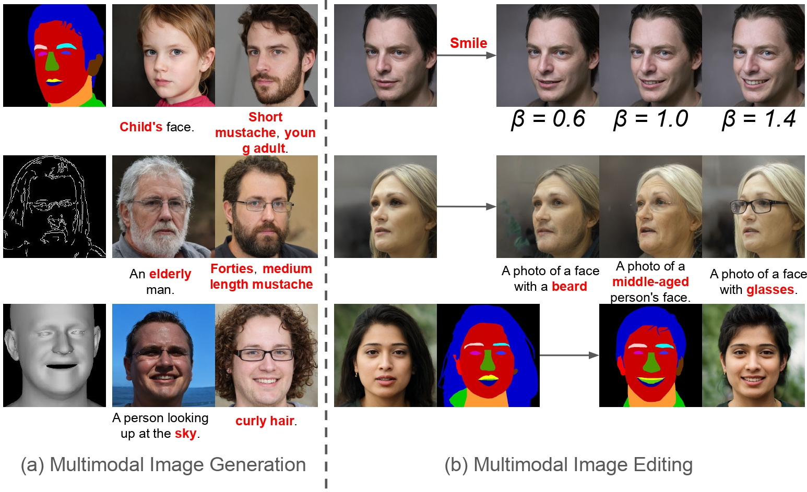

# MM2Latent: Text-to-facial image generation and editing in GANs with multimodal assistance
[](https://www.arxiv.org/abs/2409.11010)
[](https://www.arxiv.org/abs/2409.11010)

Authors' official PyTorch implementation of the ***"MM2Latent: Text-to-facial image generation and editing in GANs with multimodal assistance"***, accepted in the Advances in Image Manipulation workshop (**AIM**) Workshop of **ECCV 2024**. If you find this code useful for your research, please [cite](#citation) our paper.

> [**MM2Latent: Text-to-facial image generation and editing in GANs with multimodal assistance"**] <br>Debin Meng, Christos Tzelepis, Ioannis Patras, and Georgios Tzimiropoulos<br>
> Advances in Image Manipulation (AIM) Workshop of ECCV 2024.<br>
> **Abstract:** Generating human portraits is a hot topic in the image generation area, e.g. mask-to-face generation and text-to-face generation. However, these unimodal generation methods lack controllability in image generation. Controllability can be enhanced by exploring the advantages and complementarities of various modalities. For instance, we can utilize the advantages of text in controlling diverse attributes and masks in controlling spatial locations. Current state-of-the-art methods in multimodal generation face limitations due to their reliance on extensive hyperparameters, manual operations during the inference stage, substantial computational demands during training and inference, or inability to edit real images. In this paper, we propose a practical framework — MM2Latent — for multimodal image generation and editing. We use StyleGAN2 as our image generator, FaRL for text encoding, and train an autoencoders for spatial modalities like mask, sketch and 3DMM. We propose a strategy that involves training a mapping network to map the multimodal input into the w latent space of StyleGAN. The proposed framework 1) eliminates hyperparameters and manual operations in the inference stage, 2) ensures fast inference speeds, and 3) enables the editing of real images. Extensive experiments demonstrate that our method exhibits superior performance in multimodal image generation, surpassing recent GAN- and diffusion-based methods. Also, it proves effective in multimodal image editing and is faster than GAN- and diffusion-based methods. 



**Code coming soon...**

## 📦 Environment Setup

### Required Versions

- Python: `3.8.17`
- CUDA: `12.2.2` (built with `gcc-12.2.0`)
- Conda: environment can be created from the provided `.yml` file

### Create Conda Environment

```
conda env create -f ./environment/environement.yml
conda activate mm2latent  # or the name defined in the yml
```

## 🛠️ Installation Steps

### 1. Clone the Repository

```
git clone https://github.com/Open-Debin/MM2Latent.git
cd MM2Latent
mkdir outsource
cd outsource
git clone https://github.com/omertov/encoder4editing.git
cd ..
```
### 2. Download Pretrained Models
[StyleGAN2 Generator](https://drive.google.com/file/d/1cUv_reLE6k3604or78EranS7XzuVMWeO/view) 
Put it into your ~/models directory.

[FaRL_ep64](https://github.com/FacePerceiver/FaRL/releases/download/pretrained_weights/FaRL-Base-Patch16-LAIONFace20M-ep64.pth)
Put it into your ~/models directory.

### 4. Data Processing - Face Parsing
```
cd ./face_parsing
python face_rgb2greyseg.py
python face_rgb2sketch.py
cd ..
```
### 5. Extract Multimodal Embeddings
```
cd modalities_encoding
python greyseg2embed.py
python sketch2embed.py
cd ..
```
## ▶️ Run the Demo
Open and run the .ipynb demo files under the ~/demo directory using Jupyter Notebook or similar tools.


## Citation

If you find this work useful, please consider citing it:
```
@article{meng2024mm2latent,
  title={MM2Latent: Text-to-facial image generation and editing in GANs with multimodal assistance},
  author={Meng, Debin and Tzelepis, Christos and Patras, Ioannis and Tzimiropoulos, Georgios},
  journal={arXiv preprint arXiv:2409.11010},
  year={2024}
}
```


## Acknowledgment

This research was supported by the EU's Horizon 2020 programme H2020-951911 [AI4Media](https://www.ai4media.eu/) project.
